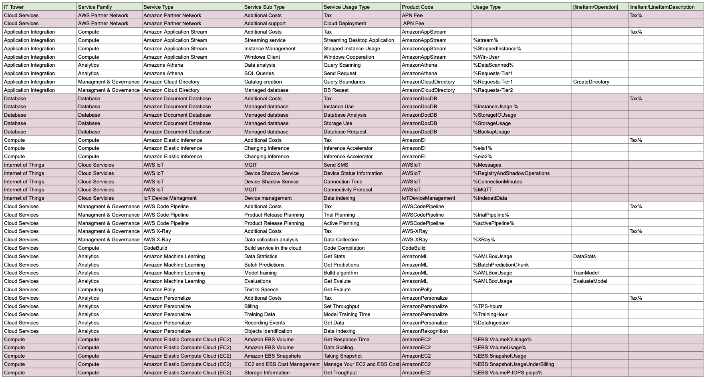

# Лабораторная работа 1. Знакомство с IaaS, PaaS, SaaS сервисами в облаке на примере Amazon Web Services (AWS). Создание сервисной модели.

## Цель работы: 
 Знакомство с облачными сервисами. Понимание уровней абстракции над инфраструктурой в облаке. Формирование понимания типов потребления сервисов в сервисной-модели.  

## Дано: 
1.  Слепок данных биллинга от провайдера после небольшой обработки в виде SQL-параметров. Символ % в начале/конце означает, что перед/после него может стоять любой набор символов.
2. Образец итогового соответствия, что желательно получить в конце. В этом же документе

## Необходимо: 

1. Импортировать файл .csv в Excel или любую другую программу работы с таблицами. Для Excel делается на вкладке Данные – Из текстового / csv файла – выбрать файл, разделитель – точка с запятой.

2. Распределить потребление сервисов по иерархии, чтобы можно было провести анализ от большего к меньшему (напр. От всех вычислительных ресурсов Compute дойти до конкретного типа использования - Выделенной стойка в датацентре Dedicated host usage)

3. Сохранить файл и залить в соответствующую папку на Google Drive.

## Алгоритм работы:
Алгоритм работы: Сопоставить входящие данные от провайдера с его же документацией. Написать в соответствие колонкам справа значения 5 колонок слева, которые бы однозначно классифицировали тип сервиса. Для столбцов IT Tower и Service Family значения можно выбрать из образца.

## Ход работы
## 1. Оформление таблицы
После выбора варианта ( в нашем случае пятый) преступили к созданию таблицы. Импортнули данные начальной , а затем для заполнения используем документацию. В итоге получили данную [таблицу](https://docs.google.com/spreadsheets/d/1-nm2PBL0ZvhUbNkA_Xr9GxM0GWYCRx3hqeHKU3ImTpA/edit?hl=ru&gid=0#gid=0)  

## Описание Сервисов  AWS
 > Amazon Web Services (AWS) – это самое распространенное в мире облако с широчайшими возможностями, предоставляющее более 200 полнофункциональных сервисов для центров обработки данных во всем мире. 

| Сервис | Описание |
| ------ | ------ |
| Amazon Application Stream |  Сервис, предназначенный для потоковой передачи приложений SaaS (программное обеспечение как услуга) и преобразования настольных приложений в SaaS без переписывания кода или рефакторинга приложения.|
|Amazon Athena |Сервис, которому не требуется дополнительная инфраструктура для масштабирования, управления и создания наборов данных . |
| Amazon Cloud Directory | Предоставляет расширяемую схему, которую можно совместно использовать с несколькими приложениями . Устраняет такие сложные задачки как масштабируемость инфроструктуры и управление серверами.|
| Amazon Document Database | Позволяет  масштабировать вычислительные ресурсы и ресурсы памяти для каждого из  экземпляров вверх или вниз . |
| Amazon Elastic Inference | Помагает в обеспечении эффективности рабочих нагрузок машинного обучения . Она позволяет пользователям подключать недорогое ускорение вывода на базе графических процессоров к экземплярам Amazon EC2, повышая скорость моделей глубокого обучения. |
|AWS IoT | Позволяет подключенным устройствам просто и безопасно взаимодействовать с облачными приложениями и другими устройствами. |
|IoT Device Management| Помогает регистрировать, упорядочивать, отслеживать устройства IoT и осуществлять управление ими в любых масштабах. |
| AWS Code Pipeline |  Позволяет моделировать, визуализировать и автоматизировать шаги, необходимые для выпуска  программного обеспечения . |
|AWS X-Ray  | Помогает разработчикам анализировать и отлаживать производственные, распределенные приложения , например, созданные с использованием архитектуры микросервисов.При его помощи можно лучше понимать как работает приложения и знать его тонкости. |
|Amazon Machine Learning  | Помогает компаниям стимулировать рост, открывать новые источники дохода и решать сложные проблемы. Позволяет персонализировать рекомендации, обнаруживать мошенничество, управлять запасами, оптимизировать цепочку поставок и улучшать обслуживание клиентов . |  
|Amazon Polly| Сервис, который генерирует голос по запросу и преобразует любой текст в аудиопоток. Помагает в озвучивании текста разными голосами и тд.|
|Amazon Personalize|Помогает повысить качество обслуживания клиентов с помощью персонализации на основе искусственного интеллекта.|
|Amazon Elastic Compute Cloud (EC2)  | Сервис, позволяющий компаниям запускать прикладные программы в публичном облаке Amazon Web Services (AWS). С помощью Amazon EC2 компании могут получать доступ к масштабируемым и безопасным вычислительным мощностям по требованию для запуска различных видов рабочих нагрузок в AWS. |
## Вывод
В ходе выполнения данной работы было проведено изучение документации AWS и заполнена таблица с классифицированными данными. 

