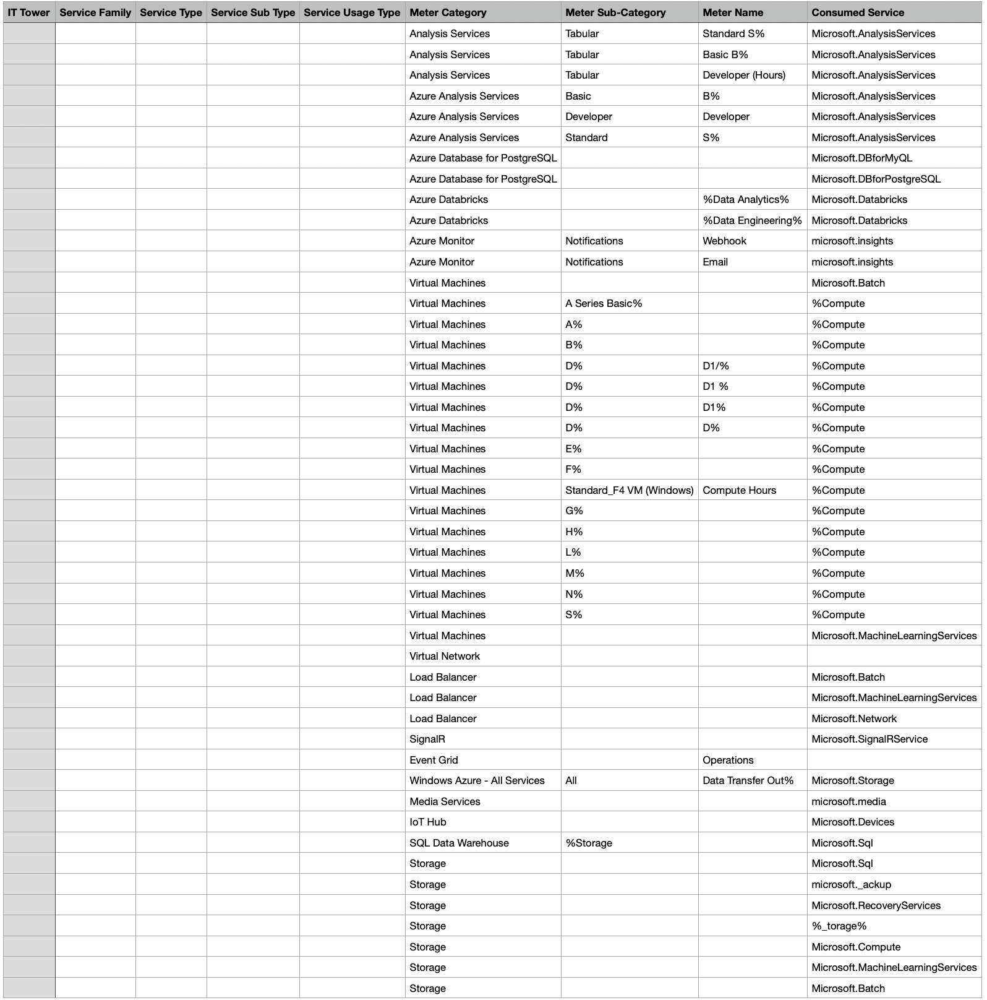
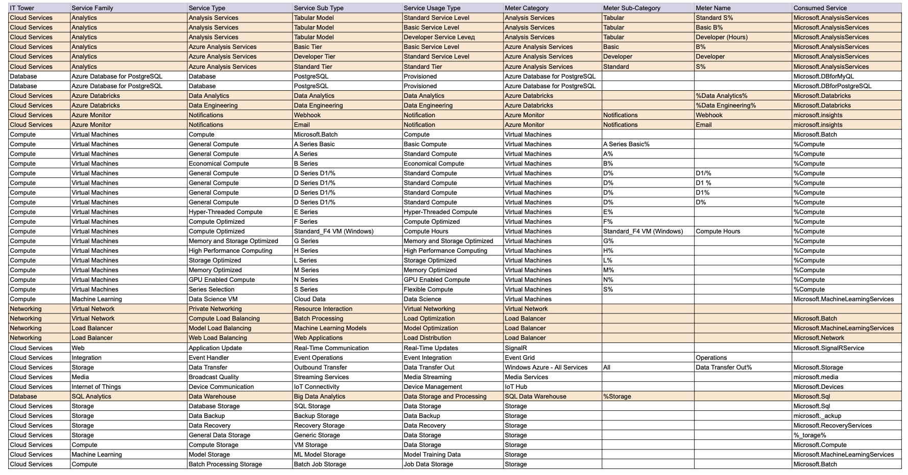

# Лабораторная работа 2. Сравнение сервисов Amazon Web Services и Microsoft Azure. Создание единой кросс-провайдерной сервисной модели.
## Цель работы: 
Получение навыков аналитики и понимания спектра публичных облачных сервисов без привязки к вендору. Формирование у студентов комплексного видения Облака. 
## Дано: 
1. Данные лабораторной работы 1.
2. Слепок данных биллинга от провайдера после небольшой обработки в виде SQL-параметров. Символ % в начале/конце означает, что перед/после него может стоять любой набор символов.
3. Образец итогового соответствия, что желательно получить в конце. В этом же документе  
## Необходимо: 
1. Импортировать файл .csv в Excel или любую другую программу работы с таблицами. Для Excel делается на вкладке Данные – Из текстового / csv файла – выбрать файл, разделитель – точка с запятой.
2. Распределить потребление сервисов по иерархии, чтобы можно было провести анализ от большего к меньшему (напр. От всех вычислительных ресурсов Compute дойти до конкретного типа использования - Выделенной стойка в датацентре Dedicated host usage).
3.  Сохранить файл и залить в соответствующую папку на Google Drive.
## Алгоритм работы:
Сопоставить входящие данные от провайдера с его же документацией. Написать в соответствие колонкам справа значения 5 колонок слева, которые бы однозначно классифицировали тип сервиса. Для столбцов IT Tower и Service Family значения можно выбрать из образца. В ходе выполнения работы не отходить от принципов классификации, выбранных в Лабораторной работе 1. Например, если сервис Машинного обучения был разбит на Вычислительные мощности и Облачные сервисы, то продолжать его разбивать и в новых данных.
## Ход работы
## 1. Оформление таблицы
После выбора варианта ( в нашем случае пятый) преступили к созданию таблицы. Импортнули данные начальной , а затем для заполнения используем Azure документации. В итоге получили даннцю таблицу: https://docs.google.com/spreadsheets/d/1X6qcHNnNo1n1pqEMolGoFbSSFv6w0iKIJPnD1UXp2dw/edit?hl=ru&gid=0#gid=0 
## Описание Сервисов Microsoft Azure
 > Облачная платформа компании Microsoft. Предоставляет возможность разработки, выполнения приложений и хранения данных на серверах, расположенных в распределённых дата-центрах.

| Сервис | Описание |
| ------ | ------ |
| Azure Analysis Services | Предоставляет модели данных корпоративного уровня в облаке. Использует для определения метрик и защиты данных в единой надежной табличной семантической модели данных. Модель данных предоставляет пользователям более простой и просмотра огромных объемов данных для специального анализа данных. |
| Azure Database for PostgreSQL | Служба реляционных баз данных в облаке Microsoft. Он основан на версии сообщества базы данных PostgreSQL с открытым исходным кодом и доступен в двух вариантах развертывания: Single Server и Hyperscale (Citus).|
| Azure Databricks | Используется для разработки и развертывания приложений искусственного интеллекта и машинного обучения. по факту она помогает упростить сложное управление данными.|
| Azure Monitor | Сервис, максимизирующий доступность и производительность приложений и услуг, предоставляя комплексное решение для сбора, анализа и обработки телеметрии из облачных и локальных сред. Он помогает понять, как работают ваши приложения, и проактивно выявляет проблемы. |
| Virtual Machines | Один из нескольких типов запрашиваемых масштабируемых вычислительных ресурсов, которые предоставляет Azure. |
| Azure Virtual Network | Обеспечивает фундаментальный строительный блок для вашей частной сети в Azure,   позволяет пользователям создавать частные сети и поддерживать их в облаке Azure .|
|Azure Load Balancer  | Является единой точкой контакта для клиентов на уровне 4 модели взаимодействия открытых систем (OSI). Он распределяет входящий трафик, который поступает на front end, по экземплярам пула на backend .. |
| SignalR| Служба, которая позволяет в реальном времени и без усилий добавлять в приложения веб-функции по протоколу HTTP. В результате клиенты обновляются без необходимости опроса сервера или отправки новых HTTP-запросов на обновления. |
| Azure Event Grid | Служба, которая позволяет легко создавать приложения с архитектурой на основе событий, она поддерживает пользовательские события с использованием соответствующих разделов. |
| Azure Media Services | Облачная платформа, которая позволяет создавать решения для потоковой передачи видео широковещательного уровня. Она повышает доступность и уровень распространения, дает возможность анализировать содержимое и предоставляет многие другие функции. |
## Вывод  
В процессе лабораторной работы было проведено ознакомление с  облачными сервисами Microsoft Azure, при котором построение таблицы благодаря которой мы выявили основыные особенности сервисов.
