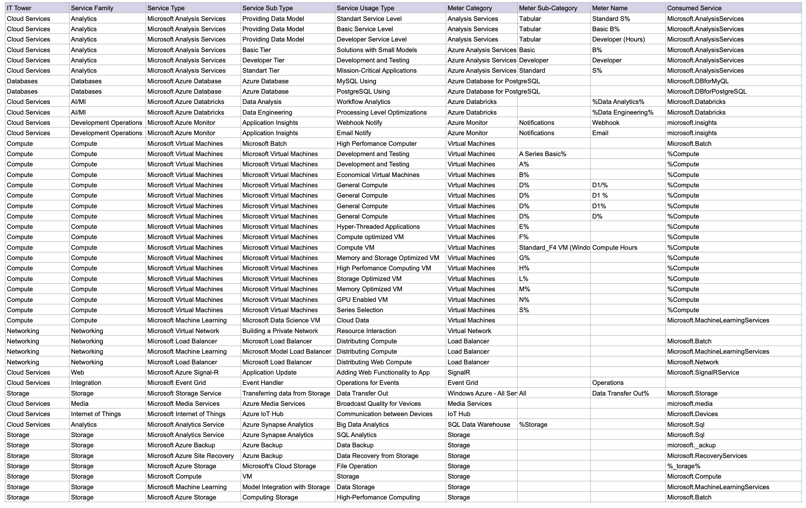

# Лабораторная работа 2. Сравнение сервисов Amazon Web Services и Microsoft Azure. Создание единой кросс-провайдерной сервисной модели.
## Дано: 
1. Данные лабораторной работы 1.
2. Слепок данных биллинга от провайдера после небольшой обработки в виде SQL-параметров. Символ % в начале/конце означает, что перед/после него может стоять любой набор символов.
3. Образец итогового соответствия, что желательно получить в конце. В этом же документе

## Необходимо: 

1. Импортировать файл .csv в Excel или любую другую программу работы с таблицами. Для Excel делается на вкладке Данные – Из текстового / csv файла – выбрать файл, разделитель – точка с запятой.
2. Распределить потребление сервисов по иерархии, чтобы можно было провести анализ от большего к меньшему (напр. От всех вычислительных ресурсов Compute дойти до конкретного типа использования - Выделенной стойка в датацентре Dedicated host usage).
3.  Сохранить файл и залить в соответствующую папку на Google Drive.

## Алгоритм работы:
Сопоставить входящие данные от провайдера с его же документацией. Написать в соответствие колонкам справа значения 5 колонок слева, которые бы однозначно классифицировали тип сервиса. Для столбцов IT Tower и Service Family значения можно выбрать из образца. В ходе выполнения работы не отходить от принципов классификации, выбранных в Лабораторной работе 1. Например, если сервис Машинного обучения был разбит на Вычислительные мощности и Облачные сервисы, то продолжать его разбивать и в новых данных.
## Ход работы
## 1. Оформление таблицы
После выбора варианта ( в нашем случае пятый) преступили к созданию таблицы. Импортнули данные начальной таблицы, а затем для заполнения используем Azure документации. В итоге получили данную таблицу:  [ссылка на таблицу](https://docs.google.com/spreadsheets/d/1X6qcHNnNo1n1pqEMolGoFbSSFv6w0iKIJPnD1UXp2dw/edit?hl=ru&gid=0#gid=0 "доступ открыт!")

## Описание Сервисов Microsoft Azure
 > Облачная платформа компании Microsoft. Предоставляет возможность разработки, выполнения приложений и хранения данных на серверах, расположенных в распределённых дата-центрах.

| Сервис | Описание |
| ------ | ------ |
| Azure Analysis Services | Платформа, предоставляющая модели данных корпоративного уровня в облаке.  Модель данных помогает пользователям быстрее выполнять специальный анализ данных с помощью таких инструментов, как Power BI и Excel. |
| Azure Database for PostgreSQL | Служба реляционных баз данных в облаке Microsoft. Обладает большим количеством плюшек, которые позволяют не тратить драгоценное время и ресурсы на управление виртуальными машинами и инфраструктурой, а сосредоточиться на быстрой разработке приложений и ускорить выход на рынок. |
| Azure Databricks | Единая, открытая платформа аналитики для создания, развертывания, совместного использования и обслуживания корпоративных данных, аналитики и решений искусственного интеллекта в масштабе. Платформа аналитики данных Databricks интегрируется с облачным хранилищем и безопасностью в облачной учетной записи, а также управляет и развертывает облачную инфраструктуру от вашего имени. |
| Azure Monitor | Комплексное решение для мониторинга для сбора, анализа и реагирования на данные мониторинга из облачных и локальных сред. Azure Monitor можно использовать для повышения доступности и производительности приложений и служб. Он помогает понять, как выполняются приложения, и позволяет вручную и программно реагировать на системные события. Сервис максимизирует доступность и производительность приложений и услуг, предоставляя комплексное решение для сбора, анализа и обработки телеметрии из облачных и локальных сред. И можно назвать его помагашкой в том, чтобы разобраться как работают усройства.|
| Virtual Machines | Один из нескольких типов запрашиваемых масштабируемых вычислительных ресурсов, которые предоставляет Azure. |
| Azure Virtual Network | Служба, которая обеспечивает фундаментальный строительный блок для вашей частной сети в Azure. Экземпляр службы (виртуальная сеть) позволяет многим типам ресурсов Azure безопасно взаимодействовать друг с другом, с Интернетом и локальными сетями. Эти ресурсы Azure включают виртуальные машины (ВМ).|
|Azure Load Balancer  | Служба Azure Load Balancer работает на уровне 4 модели OSI (Open Systems Interconnection). Она служит единственной точкой взаимодействия с клиентами. Служба распределяет входящие потоки, поступающие на интерфейс подсистемы балансировки нагрузки для экземпляров внутреннего пула. Эти потоки распределяются в соответствии с настроенными правилами балансировки нагрузки и пробами работоспособности. Экземпляры серверного пула могут быть виртуальными машинами Azure или масштабируемыми наборами виртуальных машин. |
| SignalR| Служба, которая упрощает процесс добавления веб-функций в режиме реального времени в приложения. Его можно использовать для добавления любых веб-функций в режиме реального времени в приложение ASP.NET.А также включает совершенно новые типы веб-приложений, требующих высокочастотных обновлений с сервера, например игры в режиме реального времени.|
| Azure Event Grid | полностью масштабируемая полностью управляемая служба распространения сообщений Pub Sub, которая предлагает гибкие шаблоны потребления сообщений с помощью протоколов MQTT и HTTP. С помощью нее можно создавать конвейеры данных с данными устройства, интегрировать приложения и создавать бессерверные архитектуры на основе событий.  Она позволяет клиентам публиковать и подписываться на сообщения по протоколам MQTT версии 3.1.1 и версии 5.0 для поддержки решений Интернета вещей (IoT).|
| Azure Media Services | Облачная платформа, которая позволяет создавать решения для потоковой передачи видео широковещательного уровня. Она повышает доступность и уровень распространения, дает возможность анализировать содержимое и предоставляет многие другие функции. |

## Вывод  
В процессе лабораторной работы было проведено ознакомление с  облачными сервисами Microsoft Azure, при котором построение таблицы благодаря которой, мы выявили основыные особенности сервисов. 
