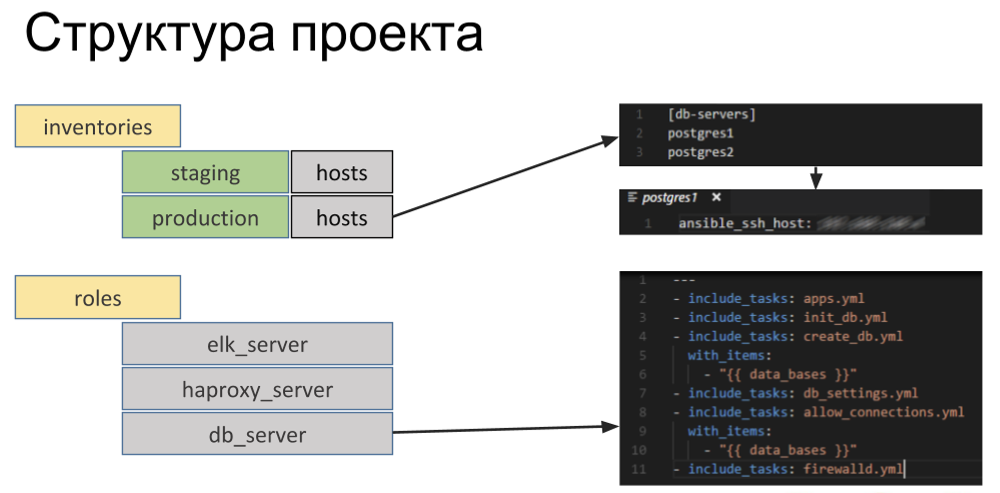

# Рубежная работа 1

## Вариант 6

### Я – начинающий аналитик, которому нужно постичь машинное обучение. Как мне может помочь в этом облако?

Для начала изучения машинного обучения может быть недостаточно ресурсов простого домашнего компьютера, например, объема оперативной памяти или мощности процессора. В этом случае можно использовать **облака**. Простой пример — **Google Colab**, который бесплатно предоставляет минимальный набор ресурсов для обучения простых моделей:
- Оперативная память: 12.7 GB.
- Диск: 107.7 GB.
> (данные с моего аккаунта)

Для продвинутого машинного обучения также актуально использование облачных сервисов. Это позволяет:
- Легко масштабировать ресурсы и балансировать их в зависимости от надобности.
- Использовать потребление ресурсов только во время обучения и работы, когда они не нужны можно поставить "на паузу" или закрыть
- Также, например, при постройке конфигурации в облаке можно взять наиболее мощный графический процессор и выполнять основные вычисления на нём. Это ускорит процесс при параллельных вычислениях

Кроме того, это дешевле, чем подбор и покупка собственного оборудования, поскольку облачные платформы дают возможность гибкого управления затратами.

#### **Дополнительные преимущества**
- Многие облачные платформы предлагают специальные конфигурации облаков для машинного обучения со встроенными инструментами и заранее настроенным оборудованием для упрощения работы с машинным обучением
- Ещё одним плюсом облаков можно отметить совместную работу. Над одной Моделью можно параллельно и удобно работать всей командой

#### **Вывод**
Облачные сервисы будут актуальны и удобны, как и в начале изучения и работы с машинным обучением, так и для работы над большими серьезными проектами.

---
# Рубежная работа 2

## Вариант 2

### Для чего введен термин Infrastructure as a Code? Какие выгоды это несет с точки зрения автоматизации, безопасности? Предложите набор компонентов, которые нужно использовать при развертывании инфраструктуры как кода.

**Инфраструктура как код** используется для автоматизации настройки инфраструктуры с помощью описания скриптом(кодом), а не с помощью консоли, сайта провайдера. Особенно этот метод полезен для разворачивания подобных(однотипных) серверов. 

- **Декларативный подход** – описание настроек ресурсов конечного состояния
- **Императивных подход** – описание всех шагов по настройке до финального

#### **Преимущества**
- Упрощение создания дубликатов, перенос инфраструктуры
- Удобство тестирования и code review
- Минимизации ошибок
- Читаемость конфигурации, истории изменений и документирование
- Увеличение скорости развёртывания
- Возможность масштабирования

#### **Инструменты**
- Terraform
- Ansible
- Chef
- Puppet
- SaltStack
- AWS CloudFormation

Также для построения полного пайплайна инфраструктуры нам понадобятся инструменты для контейнеризации, системы контроля версий, отладки и тд.

#### **Пример структуры проекта Ansible**

#### **Вывод**
IaC - стандартизированный способ описания инфраструктуры, который ускоряет и упрощает развертывание и делает ее более читаемой и для DevOps и для разработчиков. Особенно полезен при развёртывании больших продуктов с масштабной инфраструктурой.

#### **Источники**
- [Статья Хабр](https://habr.com/ru/articles/438748/)
- [Статья Хабр](https://habr.com/ru/companies/otus/articles/570926/) - обзор инструментов
- [AWS - Инструменты разработчика](https://aws.amazon.com/ru/what-is/iac/#:~:text=Инфраструктура%20как%20код%20(IaC)%20позволяет,к%20базам%20данных%20и%20хранилище.) - Что такое инфраструктура как код?

