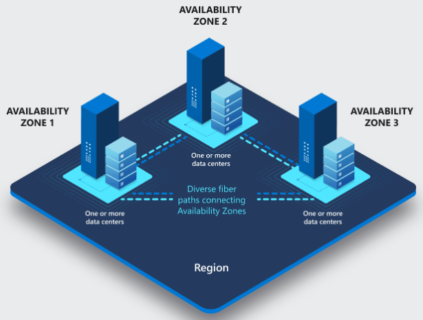

# Рубежная работа 1
## Вариант 1
### Зачем в облаке предусмотрено столько регионов? Зачем там кроме регионов еще и зоны?

> Сразу хочу обозначить, что много информации взято из документации Selectel и примеры чаще всего буду приведены на основе их инфраструктуры и опыта.

Начну с теории и понятий что такое регионы и зоны облака.

**Регион** - совокупность нескольких дата-центров (принадлежащих компании и/или их партнёров), которые расположены в агломерации крупных городов. Как пример, у Selectel дата-центры расположены в Санкт-Петербурге, Москве, Новосибирске, Ташкенте, Найроби и в Алмате; у Yandex Cloud - в Москве, Рязани, Калуге и во Владимире.

**Зоны доступности** - отдельные дата-центры внутри региона. Оно отличнаются автономностью, отдельным источниками питания и охлаждения, имеют собственные резервированные каналы связи со сверхнизкими задержками. В панели управления Selectel при выборе региона `Санкт-Петербург` доступны две зоны: `Зона доступности 1` и `Зона доступности 2`. В каждой из зон есть свои пулы (один или несколько). **Пул** - часть инфраструктуры внутри одного дата-центра. В `Зоне доступности 2` есть два пула: `ru-1` и `ru-9`.

Есть хорошая картинка, которая примерно описывает архитектуру облака и дата-центров:

#### Зачем всё это надо?

1. **Распределение нагруженности и уменьшение задержек.** Пользователи находятся на разных территориях и для того, чтобы обеспечить наилучшее соединение с облаком, строят дата-центры в разных регионах. Например, минимальную задержку клиент с Дальнего Востока получит при подключении к региону `Новосибирск`, нежели чем у региона `Санкт-Петербург`.
2. **Безопасность.** Создание изолированных пулов внутри одного дата-центра позволяет перекидывать нагрузку в случае непредвиденных аварий и хранить резервные копии данных (*повышение отказоустойчивости*)
3. **Соответсвие законодательству.** В РФ для размещения государственных информационных систем (ГИС), информационных систем персональных данных (ИСПДн) и автоматизированных систем (АС) с повышенными уровнями безопасности создают отдельные пулы, которые соотвествуют нормам, установленными на законодательном уровне.
4. **Масштабируемость**. Создание новых зон доступности внутри регионов позволяет ставить больше стоек серверов и обслуживать большее количество пользователей.

По факту, регионы позволяют создавать глобальное покрытие, а зоны доступа - локальное.

#### Источники:
1. [Документация](https://docs.selectel.ru/control-panel-actions/infrastructure/?pk_vid=0b94dfadfdffbeca1734703178373855) Selectel про регионы, зоны доступности и пулы облаков
2. [Регионы и зоны доступности](https://aws.amazon.com/ru/about-aws/global-infrastructure/regions_az/?utm_source=chatgpt.com) из документации AWS
3. [Зоны доступности](https://learn.microsoft.com/ru-ru/azure/reliability/availability-zones-overview?utm_source=chatgpt.com&tabs=azure-cli) из документации Microsoft Learn
4. [Статья на Хабре](https://habr.com/ru/companies/selectel/articles/674212/) про то, как быстро запускать новые регионы на примере опыта Selectel
5. [Видео](https://www.youtube.com/watch?v=MHgo0oAdCQg), где объясняются понятия регионов, зон доступности и пулов на примере AWS

# Рубежная работа 2
## Вариант 4
### Какие есть способы экономить в облаке? Объясните подробно разницу между моделью использования по требованию (on demand) и резервацией мощностей (reserved). Есть ли другие модели использования облака?

> Основной принцип оптимизации расходов в облаке - адекватная оценка ожидаемой нагрузки на облако + грамотный риск-менеджмент в нетипичных ситуациях + выключать всё ненужное + минимизировать резерв насколько это возможно

#### Экономия в облаке
Пройдёмся по способам и инструментам, при помощи которых можно сэкономить в облаке
**Мониторинг системы.** Важно знать как нагружается машина. Смотреть лучше усреднённые данные за месяц и данные за несколько дней. Усреднённые данные за месяц будут полезны для понимания степени резервирования или нехватки ресурсов в целом. Также вы сможете спрогнозировать примерные сроки, когда текущей мощности перестанет хватать, если нагрузки постепенно растут. Данные за несколько дней смогут показать суточные колебания, обычно связанные с жизненным циклом часовых поясов, и резкие одиночные всплески, когда ресурсы оказываются в дефиците. Есть специальные инструменты для мониторинга нагрузки системы: `Zabbix, Prometheus, Grafana, Datadog, InfluxDB (TICK stack)`. Также часто провайдеры в панели управления предоставляют информацию о нагруженности системы и цену, которую заплатили за использование тех или иных мощностей. (у Selectel есть `Потребление платформы` в `Панели управления`, у Yandex Cloud есть инструмент `Yandex Monitoring`).
**Анализ аномалий**. Yandex Cloud предлагает инструмент `Yandex DataLens`, который анализирует и визуализирует данные. Так можно посмотреть в какой период и какой сервис потребляет больше всего ресурсов и на основе этого стоить подумать как оптимизировать его. Например, можно увидеть медленные запросы к БД slowlog, и подумать нужны ли они вообще либо думать как сократить время их обработки.
**Использование ядра частично.** Для некоторых случаев, например для хостинга сайта или при запуске стейджинга, не нужна полная нагрузка на ядро. Для этого можно использовать ядра с частичным использованием (у Selectel они называются Shared Line). Ядро делитсяна несколько частей между соседями, выбирается та доля ядра, которая точно будет задействована. Например, для хостинга сайта требуется 40% мощности от ядра, такую часть можно купить у провайдера, при этом гарантированно получить именно эту долю ядра. Если соседей по ядру нет, то можно получить вплоть до 100% мощности ядра.
**Плавающий IP-адрес.** Это называется OpenStack. Плавающий IP != динамический IP. Плавающий IP == публично маршрутизируемый IP-адрес. Подходит для ситуации, когда не требуется большое количество IP-адресов (только 1-2). Нет смысла переплачивать за публичную подсеть, где доступно 5 и более IP-адресов, 3 из которых не используются.
**Автоскейлинг.** Если нагрузка на ВМ волатильна, то лучше воспользоваться услугами автоскейлинга. По факту, сначала собирается минимальная конфигурация на которой будет работать инфраструктура, но при повышении нагрузки будут добавляться новые ресурсы. В отсутсвие нагрузки ненужные ресурсы будут отключаться и не использоваться. Также это удобно для исключения человеческого фактора, когда можно забыть выключить ту или иную машину после спада пика нагрузки. Сервисы предлагают автоматизировать процесс автоскейлинга. Сюда же можно отнести установку квот на ресурсы - настройка верхнего порога потребления ресурсов.

Это основные поинты, которые можно использовать для экономии в облаке.

#### Модели использовании облака
**Модель использования по требованию (on demand).** В этой модели платят только за те ресурсы, которые сейчас используются. По факту это примерно как автоскейлинг. Часто используется посекундная, поминутная или почасовая оплата. Выключаются по требованию. Обычно дороже, чем RIs, подходит в основном для краткосрочного использования ресурсов.
**Модель использования с резервацией мощностей (reserved instances).** В этой модели резервируется нужное количество ресурсов, в основном это используется при долгосрочном сотрудничестве (1-3 года) с предоплатой или помесячным биллингом. Выключение происходит только по истечению срока контракта. Экономно для постоянных и предсказуемых рабочих нагрузок, потому что провайдеру тоже выгодно знать, что эти мощности точно не будут простаиваться на прериод заключения контракта
**Модель использования по запросу на вторичном рынке (Spot Instances).** Если у провайдера есть временно неиспользуемые ресурсы, то он может предложить их со скидкой. Идеально подходит для временных или второстепенных задач, но при этом провайдер оставляет за собой право отключить эти ресурсы в любой момент
**Безсерверные вычисления (Serverless).** Это облачная модель, в которой пользователи запускают свой код без необходимости управлять серверами. Все аспекты инфраструктуры, такие как масштабирование, обновления, и распределение ресурсов, полностью управляются провайдером облачных услуг

Есть ещё много моделей использования облаков, которые предлагают разные провайдеры, в основном это гибриды вышеперечисленных моделей.

#### Источники:
1. [Статья](https://selectel.ru/blog/saving-iaas/) Selectel про экономию в облаке
2. [Статья](https://yandex.cloud/ru/blog/posts/2019/12/economy) Yandex Cloud про экономию в облаке
3. [Reserved Instances (RIs)](https://aws.amazon.com/aws-cost-management/aws-cost-optimization/reserved-instances/) от AWS
4. [Стать](https://aws.amazon.com/compare/the-difference-between-on-demand-instances-and-reserved-instances/) от AWS про разницу on demand RIs
