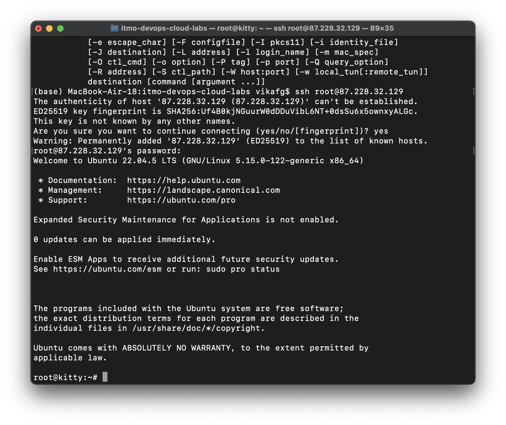
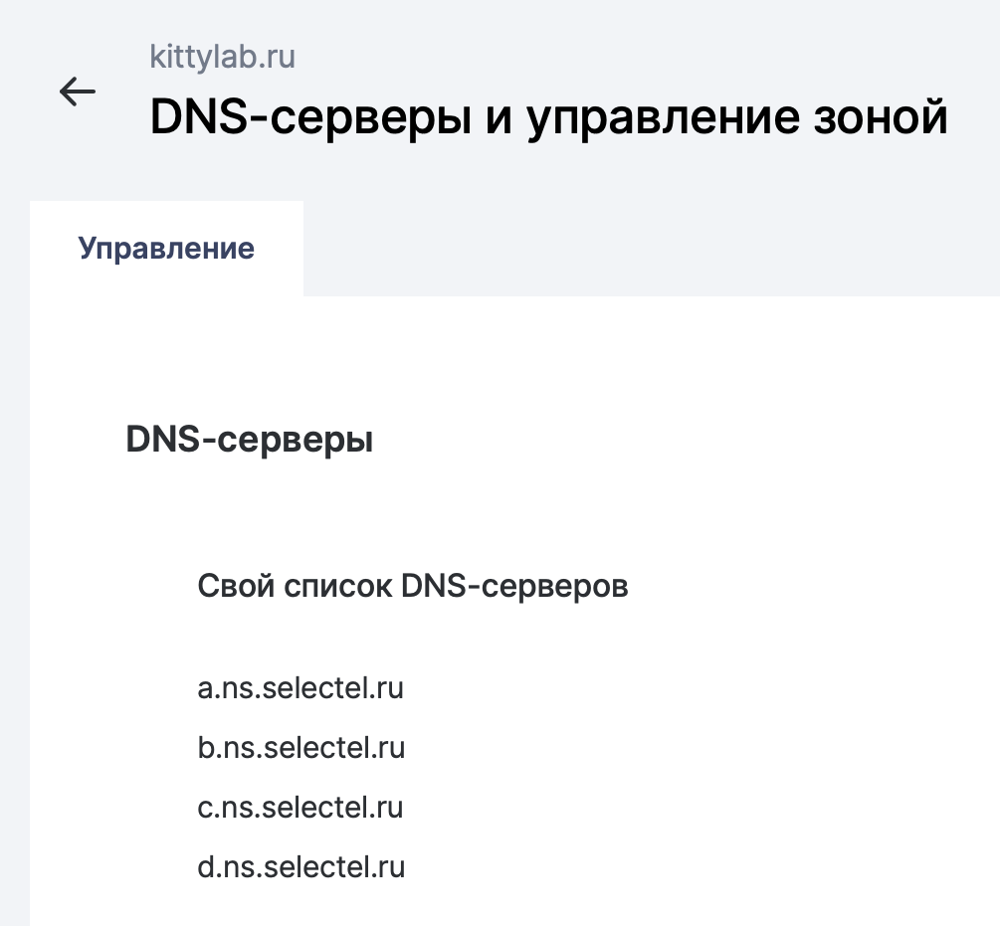
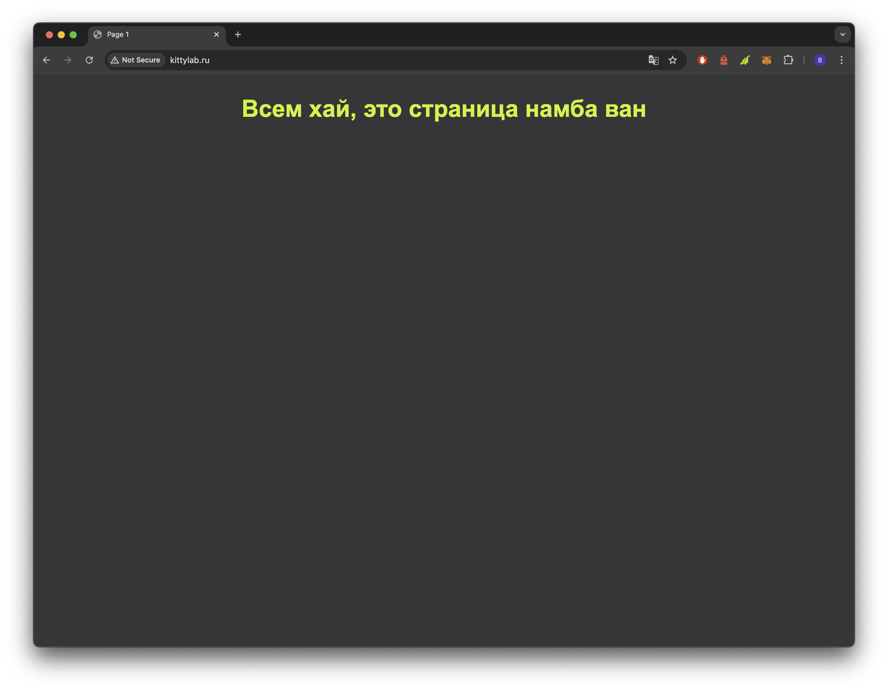

### Задание
Настроить nginx по заданному тз:
1. Должен работать по https c сертификатом
2. Настроить принудительное перенаправление HTTP-запросов (порт 80) на HTTPS (порт 443) для обеспечения безопасного соединения.
3. Использовать alias для создания псевдонимов путей к файлам или каталогам на сервере.
4. Настроить виртуальные хосты для обслуживания нескольких доменных имен на одном сервере.
5. Что угодно еще под требования проекта

### Решение

#### Подготовка
В целом не очень хотелось играться на локальной машиене, поэтому мы решили всё это дело захостить. Предварительно написали два простых `.html` файла, они доступны в папке `src`.

Для развёртывания проекта купили самый дешёвый сервер. На картиночках можно посмотреть ip-адреса.


И купили домен (правда только один :clown_face:, зато красивый).


#### Подключение к серверу

К купленному серверу подлючаемся по ssh-ключу.
Сначала проверяем, что ssh установлен на нашей машине и видим прекрасный вывод, что всё у нас окей, можно дальше работать


Далее непосредственно подключаемся к нашему серверу
```
ssh root@87.228.32.129
```

и можем уже работать в его директории



устанавливаем нужные пакеты
```
sudo apt update
sudo apt install git-all
sudo apt install nginx
apt install vim
git --version
nginx -v
```
и подтягиваем на сервер наши два `.html` файлика с гита.

#### Настройка nginx

Запускаем nginx, проверяем что всё работает и на `http://localhost:8080` появляется стандартная страница nginx.
```
sudo nginx
cd etc/nginx/sites-enabled
```


Далее идём править конфиг. Указываем какой порт слушать, в `server_name` пока пишем публичный ip, указываем по каким ссылкам искать наши `.html` файлики, а если не находим, то показываем ошибку 404

> Не забываем после каждого изменения конфига перезапускать nginx
```
sudo systemctl restart nginx
```


nginx настроен, можем посмотреть в браузере результат


#### Подключение домена

Домен у нас куплен, его надо только активировать и к серверу привязать.
Делается это легко по инструкциям Selectel и Рег.ру, там всё доходчиво объяснено.
По факту надо только в панели управления доменом указать DNS-серверы Selectel, а на нашем сервере добавить группу с типом А




Ждём пару часов пока всё активируется и можем идти смотреть результат как вместо `87.228.32.129/page-1` видим красивый домен `kittylab.ru`




Пока мы подключены только по HTTP, теперь надо настроить HTTPS

#### Подключение HTTPS

HTTPS сертификат будем получать при помощи `certbot`, удобная и бесплатная тулза.
На их официальном сайте написано как его установить, вот команды
```
sudo apt install snapd
sudo apt-get remove certbot
sudo snap install --classic certbot
sudo ln -s /snap/bin/certbot /usr/bin/certbot
```

Далее мы запускаем `certbot`, идём по инструкции, указываем свой домен и потом нас поздравляют с получением сертификата
```
sudo certbot --nginx
```


Убедимся, что сертификат реально получен, перейдя на наш сайт и заглянув в конфиг nginx


##### Один моментик

Мы чуть-чуть просчитались, купили всего один домен, а на оставшиеся деньги уже был куплен кофе. В принципе подключение нескольких доменных имён ничего не отличается от подключения одного доменного имени.
Проделываем такие же манипуляции с новым доменным именем, что и в пункте "Подключение домена".
Идём в конфиг nginx, дописываем в `server_name` новые доменные имена


И накидываем на эти доменные имена сертификаты
```
sudo certbot --nginx -d kittylab.ru -d www.kittylab.ru -d kittylab.online -d www.kittylab.online
sudo service nginx restart
```
That's all!

### Выводы

Было довольно весело разбираться как что работает, как настраивать и хостить свои сервера, как подвязывать домен.
Лаба супер, лаба класс, прикладная и полезная
Have a good day! :giraffe:
