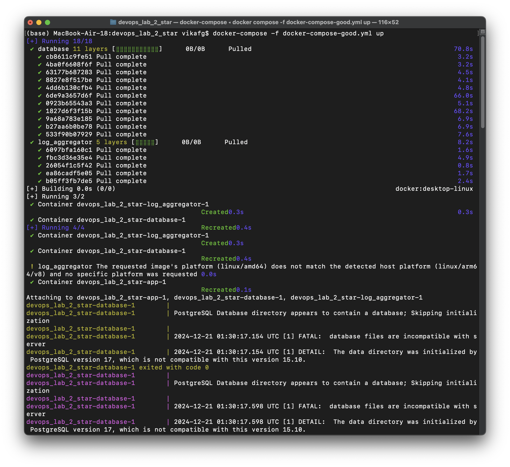
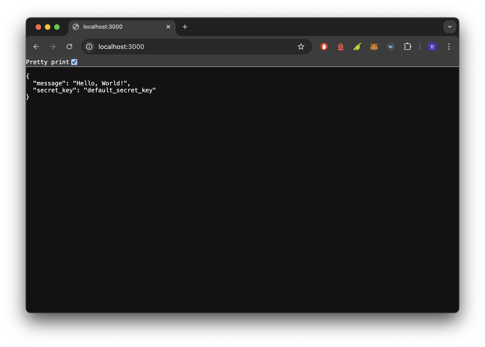
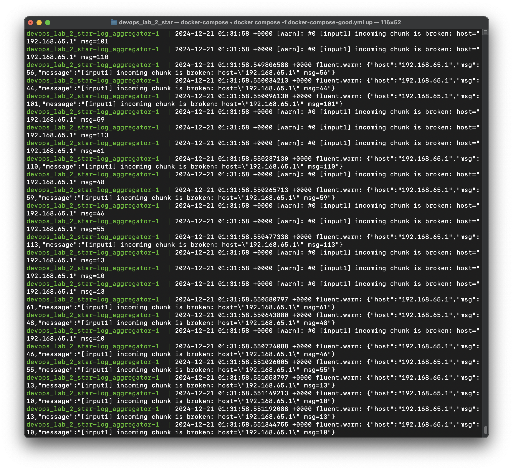

## Задание

1. Написать “плохой” Docker compose файл, в котором есть не менее трех “bad practices” по их написанию
2. Написать “хороший” Docker compose файл, в котором эти плохие практики исправлены
3. В Readme описать каждую из плохих практик в плохом файле, почему она плохая и как в хорошем она была исправлена, как исправление повлияло на результат
4. После предыдущих пунктов в хорошем файле настроить сервисы так, чтобы контейнеры в рамках этого compose-проекта так же поднимались вместе, но не "видели" друг друга по сети. В отчете описать, как этого добились и кратко объяснить принцип такой изоляции

## Решение

#### Чуть-чуть теории

**Docker Compose** - это такой специальный файлик, который позволяет автоматизировать запуск несколько контейнеров (компонентов) одной командой (грубо говоря), одним файлом управлять и развёртывать проект, чтобы разные сервисы могли общаться друг с другом. Файл `docker-compose.yaml` должен находится в корневой папке проекта и, соответсвенно, запускаться оттуда. Он определяет версию, службы, сети, тома, конфигурации и секреты.

Если открыть [документацию](https://docs.docker.com/compose/) по Docker Compose, то можно найти `how-tos` - best practices in writting docker-compose file. Что там есть?

- **Specify a project name** - указание название проекта. Не всегда требуется, потому что по умолчанию использует имя корневого каталога, но эта практика полезна
- **Use lifecycle hooks** - использование post-start и pre-stop хуков
- **Use service profiles** - можно указать профили, которые позволяют включать или выключать определённые сервисы в зависимости от окружения, часто используют в тестировании
- **Control startup order** - для определения порядка запуска сервисов можно использовать `depends_on`
- **Use environment variables** - файл `.env` записывают переменные, которые потом можно использовать в `docker-compose.yaml`, используется для гибкости конфигурации, да и вообще best practice ever and forever.
- **Use Compose Watch** - поменяли код - автоматически перезапускается Docker
- **Secrets in Compose** - использование секретов для передачи конфиденциальной информации
- **Use multiple Compose files** - разделение конфигураций на несколько файлов упрощает управление окружениями (например, `dev` и `prod`)
- **Use Compose in production** - использование docker compose в проде: удаление любых привязок томов для кода приложения, привязывание к различным портам на хосте, изменять переменные окружения, указать как будет перезапускаться приложение, включить логгер

#### Собираем аппку

Быстро накидали приложение на Flask (исходный код `./app/app.py`) и собрали Dockerfile:

```Dockerfile
# Dockerfile

FROM python:3.9-slim

WORKDIR /app

COPY app/requirements.txt /app/

RUN pip install --no-cache-dir -r requirements.txt

COPY app /app

CMD ["python", "app.py"]
```

#### Bad practices Docker Compose

Мы решили, что для работы нашего проекта понадобится БД, значит через docker-compose подключим ещё и Postgres. Только мы совсем не читаем документацию и делаем как чувствуем (а чувствуем мы плохо):

```yaml
# docker-compose-bad.yml

version: '3.8'

services:
  app:
    build:
      context: .
    ports:
      - "3000:5000"
    environment:
      - SECRET_KEY=my_secret_key # Секреты прописаны в конфиге (плохо)
      - DB_PASSWORD=password123
      - DB_HOST=database
      - DB_NAME=real_project_db
      - DB_USER=postgres
    volumes:
      - ./app:/app # Монтирование кода для разработки (плохо для production)
    restart: "no" # Нет политики перезапуска (плохо)
    depends_on:
      - database

  database:
    image: postgres
    ports:
      - "5432:5432"
    environment:
      - POSTGRES_PASSWORD=password123 # Пароль указан в переменной окружения (плохо)
      - POSTGRES_DB=real_project_db
      - POSTGRES_USER=postgres
    volumes:
      - postgres_data:/var/lib/postgresql/data
    restart: "no" # Нет политики перезапуска

volumes:
  postgres_data:
```

В комментариях к коду указаны bad practices, но при этом всё у нас собирается и работает

Терминал плохого docker-compose:


Сайт плохого docker-compose:



#### Good practices Docker Compose

Ладно, на плохих практиках Docker Compose всё собирает и всё исправно работает, но мы хотим стать хорошими разработчиками (🦒), поэтому надо с младу учиться делать всё красиво. Решили ещё и логгер добавить, потому что отслеживать состояние системы очень важно! Поэтому перепишем наш docker-compose:

```yml
# docker-compose-good.yml

version: '3.9'

services:
  app:
    build:
      context: .
    ports:
      - "8080:5000" # Используем нестандартный порт для внешнего доступа
    environment:
      - LOG_LEVEL=info # Уровень логирования снижен для production
      - DB_HOST=database
      - DB_USER=postgres
      - DB_NAME=testdb
    secrets:
      - secret_key # Используем Docker Secrets для хранения конфиденциальных данных
    restart: always # Перезапуск при сбое для повышения доступности
    depends_on:
      - database # Указывает, что база данных должна быть запущена перед приложением

  database:
    image: postgres:15-alpine # Используем lightweight-образ и конкретную версию
    environment:
      POSTGRES_PASSWORD_FILE: /run/secrets/db_password # Пароль через Docker Secrets
    secrets:
      - db_password
    restart: always
    deploy:
      resources:
        limits:
          memory: 256M # Ограничение памяти для предотвращения чрезмерного использования ресурсов

  log_aggregator:
    image: fluent/fluentd:v1.14-1 # Используем стабильную и поддерживаемую версию Fluentd для лог-агрегации
    ports:
      - "24224:24224" # Порт для приема логов Fluentd
    environment:
      - FLUENTD_CONF=fluent.conf # Конфигурация Fluentd
    restart: always # Перезапуск лог-агрегатора при сбоях для повышения доступности

secrets:
  secret_key:
    file: ./secrets/secret_key.txt # Путь к файлу с секретом
  db_password:
    file: ./secrets/db_password.txt # Путь к файлу с паролем для базы данных
```

Опять же, все исправления, замечания и good practices указаны в комментариях к коду. Вау ура, всё работает и при запуске

Терминал хорошего docker-compose:


Сайт хорошего docker-compose:


Логи хорошего docker-compose:


## Выводы

Docker Compose очень сильный и важный инструмент, который должен хотя бы понимать любой бэкендер, девопсы так подавно. Интересно было покапаться в документации, посмотреть как на проде всё работает.
В общем, всем спасибо за внимание, было славно!

# 🦒
