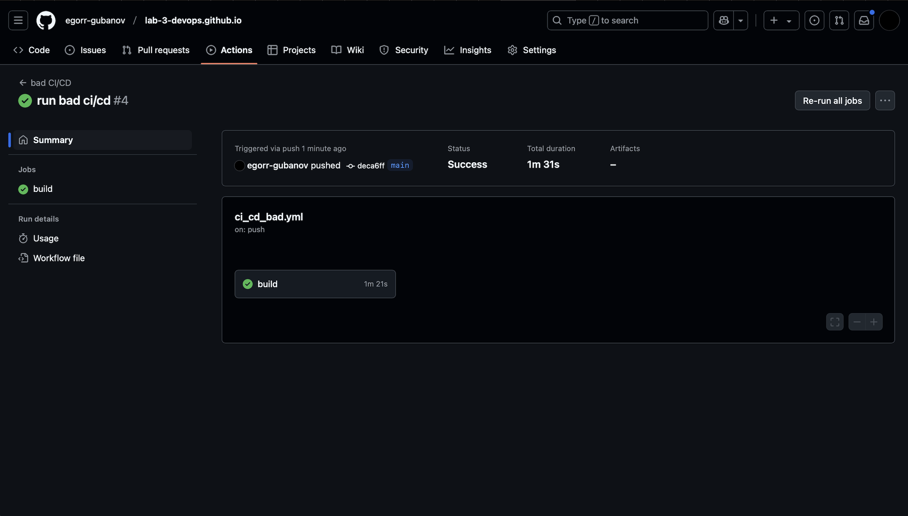
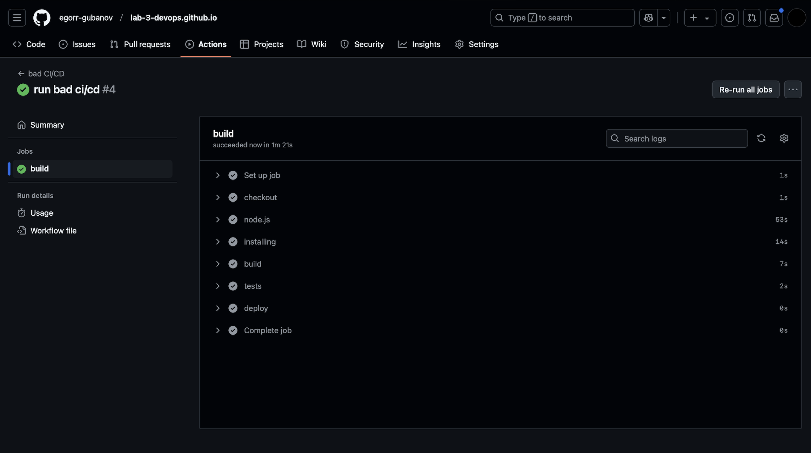
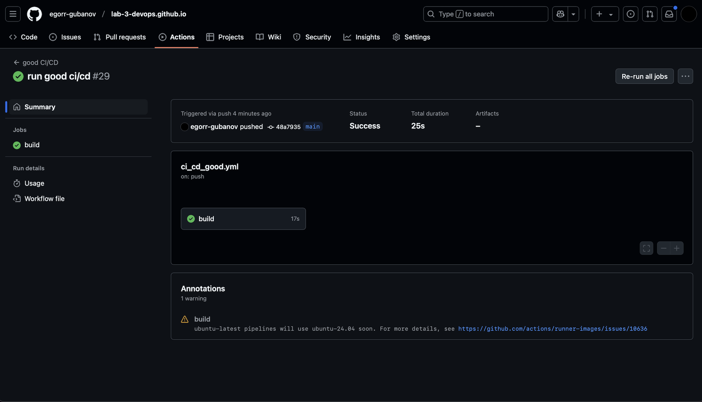

### CI/CD 🙁/😃

### Предисловие
У меня есть проект на React, и данная настройка предназначена для CI/CD с использованием GitHub Actions. Я использую GitHub Pages для развертывания приложения после изменений в `main`.

### 🙁 CI/CD:

```yaml
name: bad CI/CD

on:
  push:
    branches:
      - main

jobs:
  build:
    runs-on: ubuntu-20.04  # Старая версия 🦒

    steps:
      - name: checkout
        uses: actions/checkout@v1  # Старая версия

      - name: node.js
        run: |
          sudo apt-get update
          sudo apt-get install -y nodejs npm  # Установка Node.js вручную
      - name: installing
        run: npm install  # Нет проверки на конфликты (--legacy-peer-deps)

      - name: build
        run: npm run build

      - name: tests
        run: npm test
        continue-on-error: true  # Ошибки пропускаются

      - name: deploy
        run: echo project deployed # Деплой происходит всегда
```

#### Ошибки:

1. **Использование устаревшего образа Ubuntu (ubuntu-18.04)**
    - Эта версия уже устарела, и это может привести к уязвимостям безопасности и несовместимости с новыми инструментами
    - **Исправление:** Используем `ubuntu-latest`, который поддерживает актуальные версии инструментов и регулярно обновляется

2. **Использование устаревшей версии `actions/checkout@v1`**
    - Более старая версия менее оптимизирована и может содержать баги или уязвимости
    - **Исправление:** Обновляем до `actions/checkout@v3`, который быстрее, безопаснее

3. **Ручная установка Node.js через `apt-get`**
    - Может установить старые версии и добавить лишнюю сложность
    - **Исправление:** `actions/setup-node@v3` автоматически устанавливает нужную версию node.js

4. **Отсутствие кэширования зависимостей**
    - Каждый раз зависимости устанавливаются заново, что замедляет процесс сборки
    - **Исправление:** Добавляем кэширование с использованием `actions/cache@v3`

5. **Игнорирование ошибок при тестировании (`continue-on-error: true`)**
    - **Тогда зачем нужны тесты?🦒**
    - **Исправление:** Убираем параметр `continue-on-error`, чтобы тесты останавливали процесс при ошибках





---

### 😃 Хороший CI/CD:

```yaml
name: good CI/CD

on:
  push:
    branches:
      - main

jobs:
  build:
    runs-on: ubuntu-latest  # Актуальная версия

    steps:
      - name: Checkout repository
        uses: actions/checkout@v3  # Новая версия с улучшенной производительностью и безопасностью

      - name: Set up Node.js
        uses: actions/setup-node@v3  # Автоматическая установка Node.js
        with:
          node-version: '20.x'  # Указана актуальная версия Node.js

      - name: Cache node modules
        uses: actions/cache@v3  # Кэшируем зависимости для ускорения сборки
        with:
          path: node_modules
          key: ${{ runner.os }}-node-modules-${{ hashFiles('package-lock.json') }}
          restore-keys: |
            ${{ runner.os }}-node-modules

      - name: Install dependencies
        run: npm install --legacy-peer-deps  # Установка зависимостей с учётом возможных конфликтов

      - name: Lint the code
        run: npm run lint  # Проверка кода линтером

      - name: Build the project
        run: npm run build

      - name: Run tests
        run: npm test  # Тесты теперь обязательны для успешного завершения
        
      - name: Deploy
        if: success()
        run: echo project deployed # Деплой происходит только при успешном прохождении всех предыдущих шагов
```



---

### Вывод

Хорошая настройка развертывания значительно упрощает и ускоряет процесс разработки(обратите внимание на время сборки!)

#### Не забываем про 🦒