## Задача

Сделать красиво работу с секретами. Например, поднять Hashicorp Vault (или другую секретохранилку) и сделать так, чтобы ci/cd пайплайн (или любой другой ваш сервис) ходил туда, брал секрет, использовал его не светя в логах. В Readme аргументировать почему ваш способ красивый, а также описать, почему хранение секретов в CI/CD переменных репозитория не является хорошей практикой.

## Решение

Для работы с секретами была создана отдельная [репа](https://github.com/dontdoitno/devops_lab_3_star), чтобы случайно не наворотить делов с основной репой. В качестве секретохранилища был выбран `Hashicorp Vault`. Ещё рассматривались варианты с `Azure Key Vault` и `AWS Secrets Manager`, но они не работают на территории РФ и даже не дают аккаунт создать. Вообще хотелось сделать Dynamic secrets, которые генерируются по запросу и обновляются каждый раз (для лучшей безопасности), но это только за денюжку 😢.

### Настройка `Hashicorp Vault`

Для начала качаем докер образ `Hashicorp Vault` через
```bash
docker pull hashicorp/vault
```
(команду можно посмотреть на `Dockerhub`, там нужные команды есть)

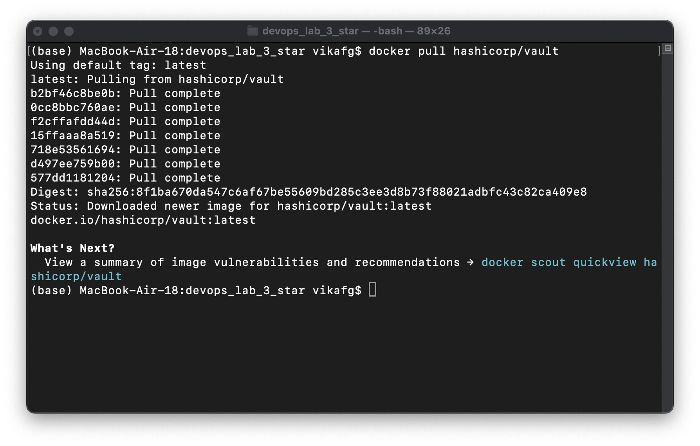

потом запускаем `Vault` через докер и настроиваем его
```bash
docker run --cap-add=IPC_LOCK -e 'VAULT_DEV_ROOT_TOKEN_ID=myroot' -e 'VAULT_DEV_LISTEN_ADDRESS=0.0.0.0:8200' -p 8200:8200 vault:1.14.0
```

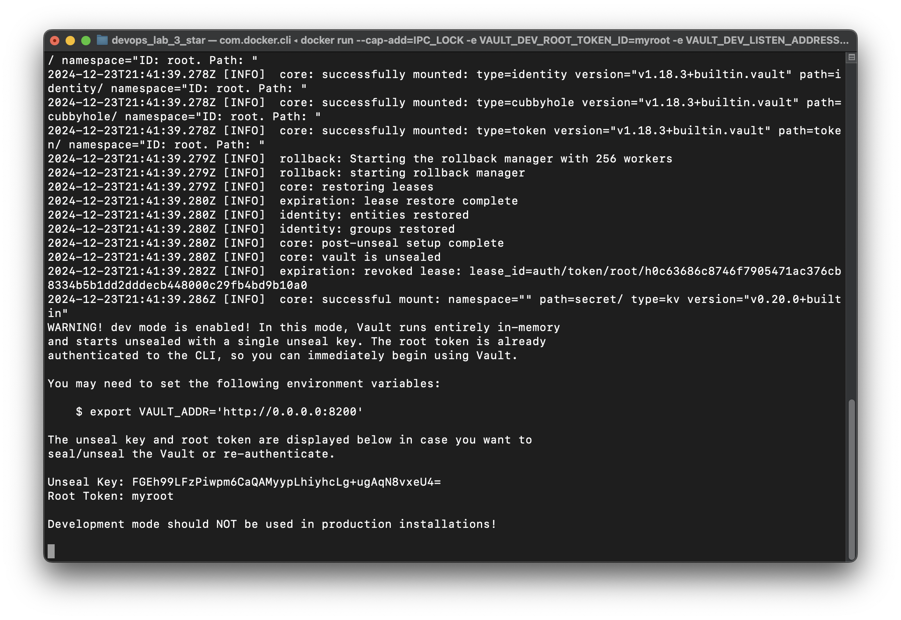

Проверяем доступен ли `Vault` локально на адресе `http://127.0.0.1:8200`, заодно логинимся по токену myroot:

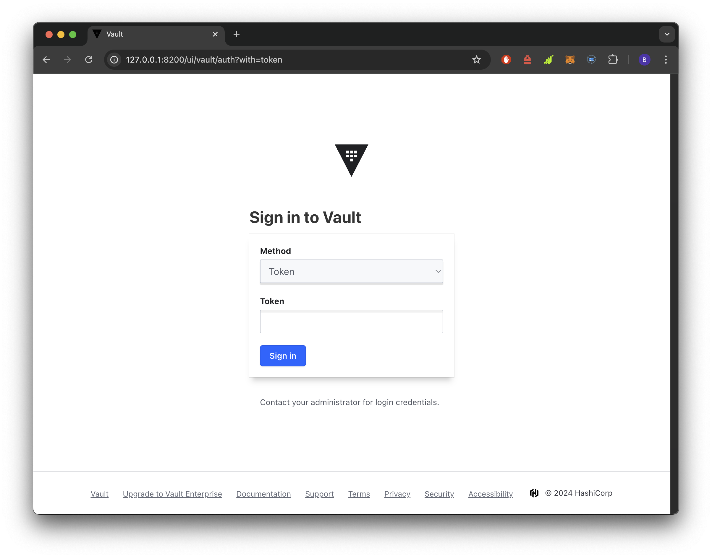
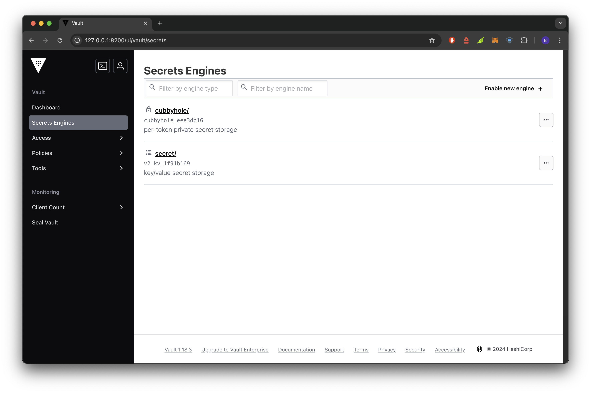

Всё гуд, работаем дальше (🦒)

Потом надо установить `Vault` локально, чтобы записать туда секреты, и после проверки чекнуть реально ли он установился или всё пошло не так как надо:
```bash
brew tap hashicorp/tap
brew install hashicorp/tap/vault

vault -version
```

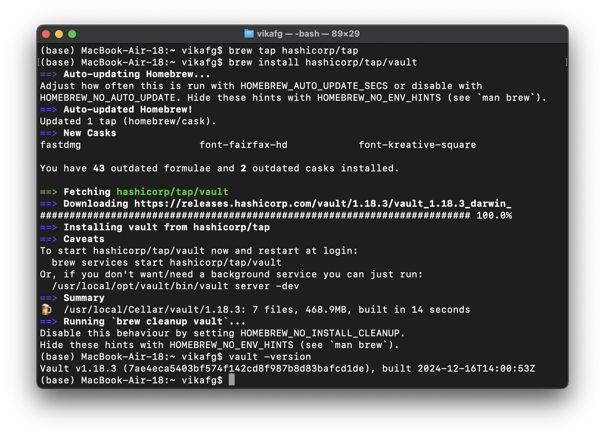

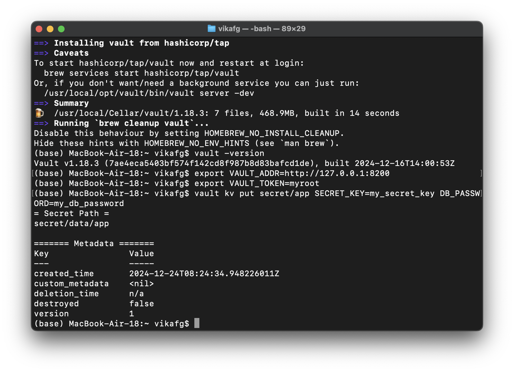

После этого закидываем наши секреты:
```bash
export VAULT_ADDR=http://127.0.0.1:8200
export VAULT_TOKEN=myroot

vault kv put secret/app SECRET_KEY=my_secret_key DB_PASSWORD=my_db_password
```

### Настройка `Dockerfile` и локальная проверка `Docker`

Для нашего приложения был написан простенький `Dockerfile`:
```Dockerfile
FROM python:3.9-slim

WORKDIR /app

COPY app/requirements.txt /app/

RUN pip install --no-cache-dir -r requirements.txt

COPY app /app

CMD ["python", "app.py"]
```

Теперь проверим собирается ли локально контейнер. В директории приложения прописываем:
```bash
docker build -t flask-app .

docker run -p 4000:4000 flask-app  # 5000 порт занят и не хочет убиваться :(
```

Всё гуд, у нас сбилдилось и запустилось на адресе `http://localhost:4000`:

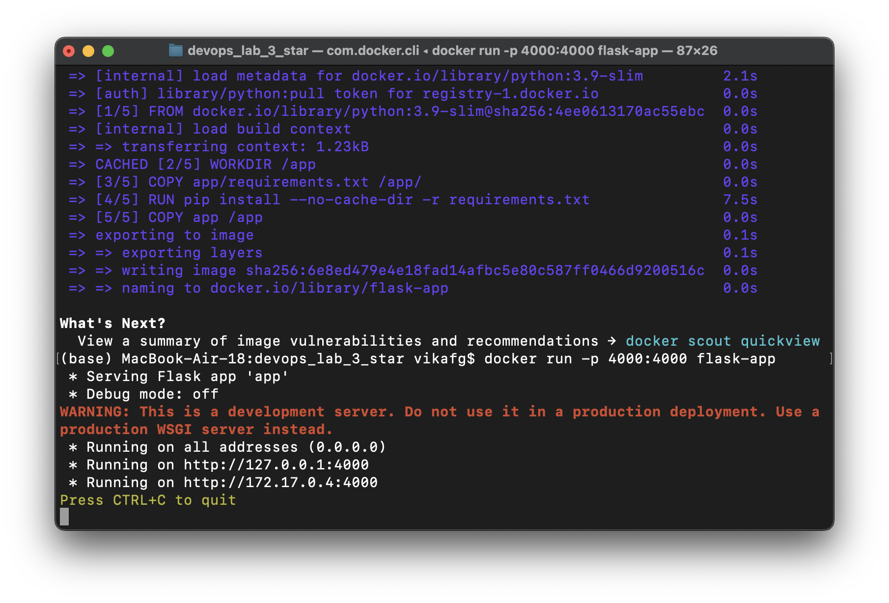

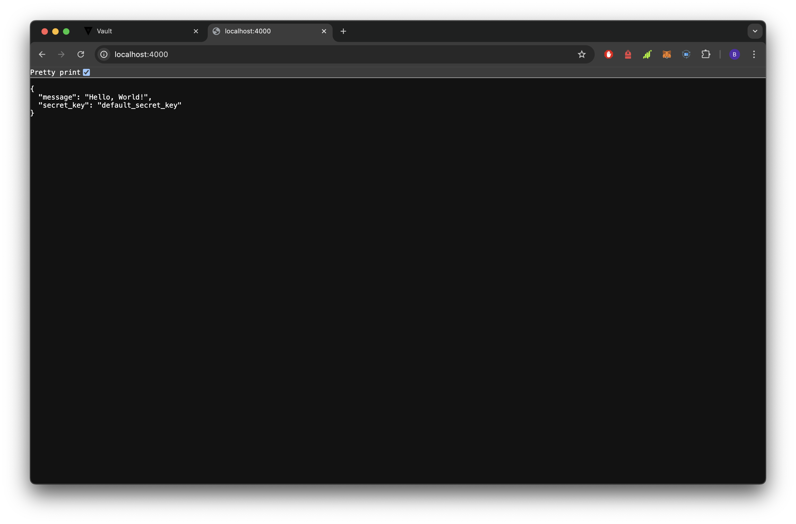

### Настройка `GitHub Secrets`

В репозитории на `GitHub` настроиваем секреты, которые будут подтягиваться для `workflow`:

> VAULT_ADDR: http://127.0.0.1:8200
> VAULT_TOKEN: myroot
> DOCKER_USERNAME: юзернейм Docker Hub
> DOCKER_PASSWORD: пароль Docker Hub

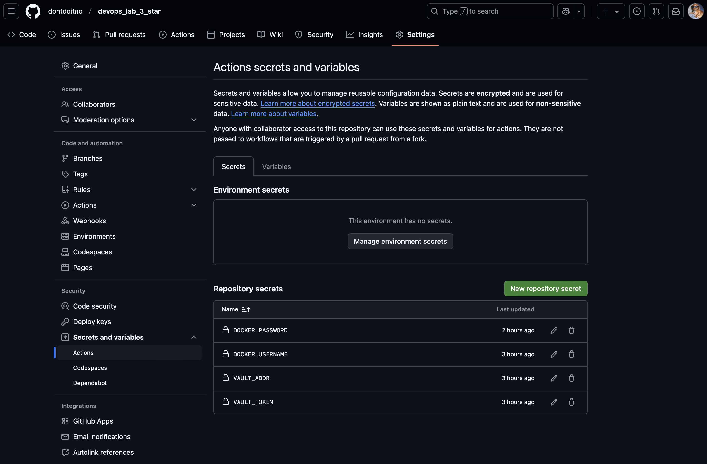

### Настройка `GitHub Actions Workflow`

Мы хотим закинуть контейнер в нашей аппкой на `Docker Hub`, этим и займёмся.
В репе создаём файлик `.github/workflows/deploy.yml`
```yaml
name: Build and Deploy

on:
  push:
    branches:
      - main

jobs:
  build:
    runs-on: ubuntu-latest

    steps:
    - name: Checkout code
      uses: actions/checkout@v3

    - name: Install dependencies
      run: |
        sudo apt-get update
        sudo apt-get install -y jq curl

    - name: Fetch secrets from Vault
      env:
        VAULT_ADDR: ${{ secrets.VAULT_ADDR }}
        VAULT_TOKEN: ${{ secrets.VAULT_TOKEN }}
      run: |
        # Получаем секреты из Vault
        SECRET_KEY=$(curl -s --header "X-Vault-Token: $VAULT_TOKEN" \
          $VAULT_ADDR/v1/secret/data/app | jq -r '.data.data.SECRET_KEY')
        DB_PASSWORD=$(curl -s --header "X-Vault-Token: $VAULT_TOKEN" \
          $VAULT_ADDR/v1/secret/data/app | jq -r '.data.data.DB_PASSWORD')

        # Сохраняем секреты в файлы
        echo "$SECRET_KEY" > secret_key.txt
        echo "$DB_PASSWORD" > db_password.txt

    - name: Build Docker image
      run: |
        docker build -t ${{ secrets.DOCKER_USERNAME }}/myapp:latest .

    - name: Login to Docker Hub
      run: |
        echo ${{ secrets.DOCKER_PASSWORD }} | docker login -u ${{ secrets.DOCKER_USERNAME }} --password-stdin

    - name: Push Docker image
      run: |
        docker push ${{ secrets.DOCKER_USERNAME }}/myapp:latest
```

и всё пушим на `GitHub`. Он сам начинает джобы деплоя, можно убедиться, что всё прошло гуд:

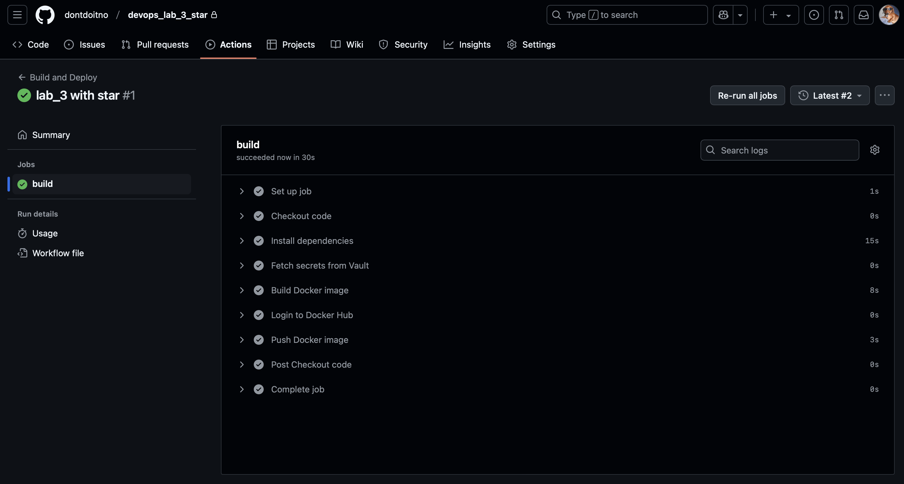

Ну и посмотрим как там дела на `Docker Hub`:

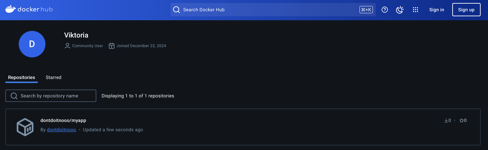

Наш контейнер успешно залился на `Docker Hub`, можно порадоваться и бежать писать отчётик. 🦒

### Почему решение хорошее?

> **Это безопасно**. Все секреты хранятся централизовано, а не в репе или переменных окружения на сервере, добраться до них становится сложнее + секреты в `HashiCorp Vault` шифруются при передаче (`TLS`) и при хранении, перехватить их сложно

> **Это автоматизировано**. Если работать с `GitHub Actions`, то он автоматически вытягивает секреты из `HashiCorp Vault`

> **Это вариативно**. Есть тонкая настройка политики доступа + если изменять секреты в `HashiCorp Vault`, то они автоматически изменятся в пайплайне

> **Это гибко**. `HashiCorp Vault` позволяет развёртывать хранилище локально, в облаке или в кластере

> **Это доступно в РФ**. Только `HashiCorp Vault` позволил зарегестрироваться будучи резидентом РФ. Насчёт работы не знаю, VPN нон-стоп включен......

## Выводы

Спасибо за лабу, было забавно и увлекательно, особенно связать докер + секреты + пайплайн и всё закинуть в воркфлоу гитхаба.

Теперь смело можно писать в резюме строчку "есть опыт работы с настройкой nginx, Docker и CI/CD".

# 🦒
